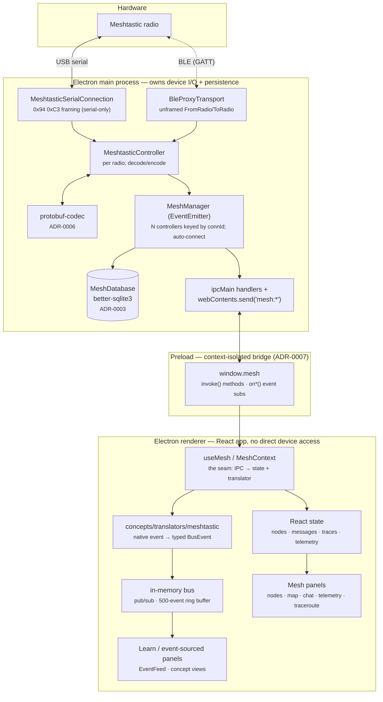
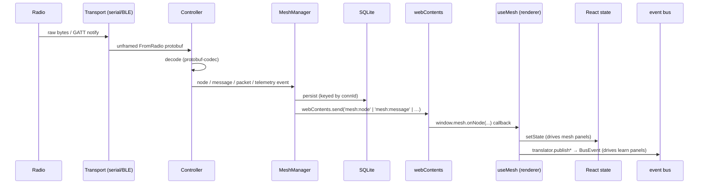
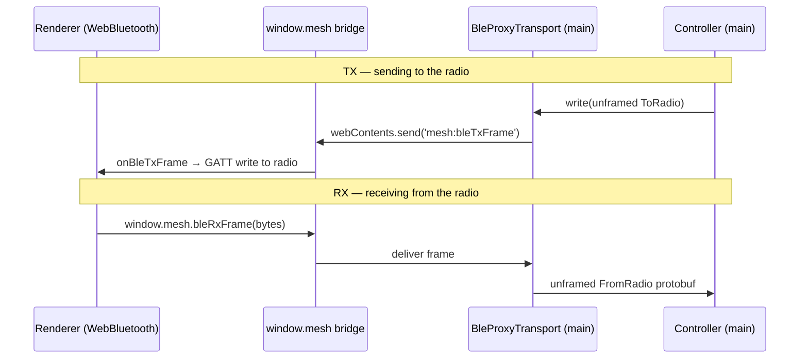

# Architecture

How the app is put together and how a byte off the radio becomes a pixel on a
panel. This is the map; the individual *why*-decisions live in [`adr/`](adr/).

## The one-paragraph version

openkb-mesh-internet is an Electron desktop app. The **main process** owns all
device I/O and all persistence: it opens transports (USB serial / BLE), decodes
the Meshtastic protobuf stream, keeps N radios alive at once, and writes a local
SQLite history. The **renderer** is a React app that never touches a device
directly — it talks to main only through a context-isolated `window.mesh` bridge,
turns the events it receives into React state, and *also* re-publishes them onto
an in-memory event bus that the learn/telemetry panels subscribe to. The security
posture and the reasoning behind each boundary are in [`../SECURITY.md`](../SECURITY.md)
and the ADRs.

## Process & data-flow model

Everything above the preload line runs with Node/OS privileges; everything below
it is sandboxed and reaches main **only** through the narrow `window.mesh`
surface. That boundary is the whole security model — see ADR-0007.

## Inbound packet — the happy path

Two consumers, one source: the same IPC event updates React state **and** is
translated into a `BusEvent`. Mesh panels read state; the event-sourced learn
panels read the bus. The translator (`concepts/translators/meshtastic.ts`) is the
only place protocol-native shapes cross into the bus vocabulary — the rest of the
app speaks in `Update`/`Topic` concept slugs, never `MeshPacket`.

## The BLE inversion (ADR-0005)

BLE is the one flow that runs *backwards*. WebBluetooth only exists in the
renderer, so for a BLE radio the renderer owns the GATT connection and the main
process holds a `BleProxyTransport` stand-in. Frames are proxied across the
bridge in both directions:

Decode still happens in main (ADR-0006); only the physical GATT hop lives in the
renderer. This keeps a single decode path regardless of transport.

## Where things live

| Concern | Code | ADR |
| --- | --- | --- |
| App shell (Electron + React + Vite + TS) | `electron/main.ts`, `src/` | [0002](adr/0002-electron-react-vite-typescript-shell.md) |
| Local history store | `electron/database.ts` | [0003](adr/0003-better-sqlite3-mesh-store.md) |
| Transport abstraction | `electron/meshtastic/transport.ts` | [0004](adr/0004-pluggable-transport-abstraction.md) |
| BLE in renderer, proxied to main | `electron/meshtastic/ble-proxy-transport.ts` | [0005](adr/0005-webbluetooth-in-renderer-proxied-to-main.md) |
| Protobuf decode in main | `electron/meshtastic/protobuf-codec.ts` | [0006](adr/0006-protobuf-decode-in-main-process.md) |
| Context-isolated IPC bridge | `electron/preload.ts` | [0007](adr/0007-context-isolated-ipc-bridge.md) |
| Unified tail-able log | `electron/main.ts` | [0008](adr/0008-unified-tailable-log-file.md) |
| Panel quality bar | `src/components/panels/` | [0009](adr/0009-panel-quality-bar.md) |
| Event bus + concept translators | `src/bus.ts`, `src/concepts/` | [0010](adr/0010-in-memory-event-bus.md) |

## The concepts / event-bus layer

The renderer carries a small **event-sourced layer** — `src/concepts/` — modelled
as `Update` and `Topic` concept instances rather than raw protocol messages. The
`bus` (`src/bus.ts`) is an in-memory pub/sub with a 500-event ring buffer so late
subscribers can replay recent history. This is deliberately the shape an
event-sourced network would use, scaled to one app; it's what lets a learn panel
say "show me every position-beacon in the last minute" without knowing anything
about Meshtastic protobufs. See [ADR-0010](adr/0010-in-memory-event-bus.md).
